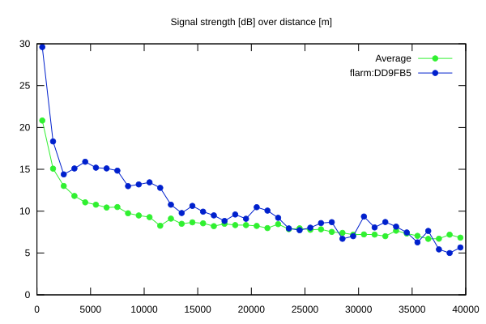
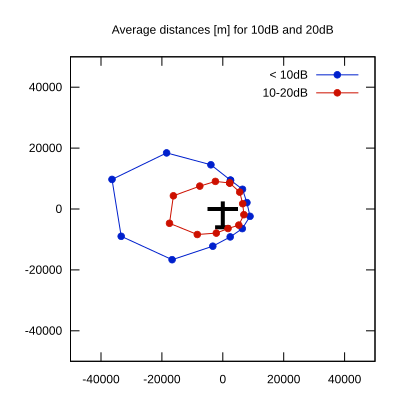

# Ktrax range report — device DD9FB5

- **Pilot:** Vytautas Rasimavicius (club, CN 16)
- **Aircraft registration:** D-2622
- **live_track_id:** `OGNC30870:FLRDD9FB5`
- **Ktrax callsign/ID:** D-2622
- **Last measurement:** 2026-07-18T16:05:33Z
- **Versions:** Hardware: 03/Software: 7.40 (received: 2026-07-18T15:32:15Z)
- **Source:** https://ktrax.kisstech.ch/plot?device=DD9FB5 (fetched 2026-07-19T09:38:11Z)

