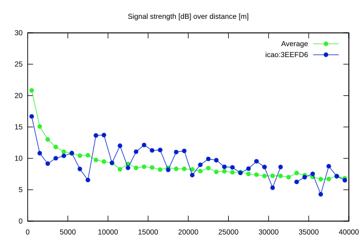
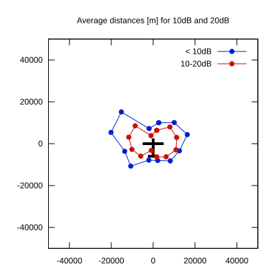

# Ktrax range report — device 3EEFD6

- **Pilot:** Robin Förster (club, CN 1X)
- **Aircraft registration:** D-3903
- **live_track_id:** `OGNBF8308:ICA3EEFD6`
- **Ktrax callsign/ID:** D-3903
- **Last measurement:** 2026-07-18T15:14:37Z
- **Versions:** Hardware: 0C/Software: 7.43 (received: 2026-07-18T15:07:36Z)
- **Source:** https://ktrax.kisstech.ch/plot?device=3EEFD6 (fetched 2026-07-19T09:38:11Z)

