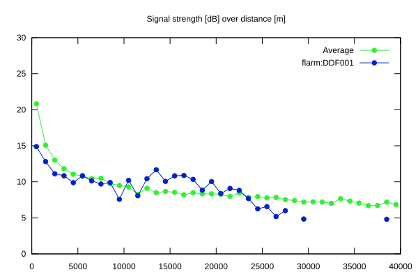
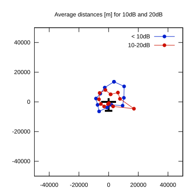

# Ktrax range report — device DDF001

- **Pilot:** Andrii Lohvynchuk (club, CN 451)
- **Aircraft registration:** SP-4360
- **live_track_id:** `OGNC30934:FLRDDF001`
- **Ktrax callsign/ID:** 9A-GSX
- **Last measurement:** 2026-07-18T15:39:55Z
- **Versions:** Hardware: 0F/Software: 7.43 (received: 2026-07-18T15:17:11Z)
- **Source:** https://ktrax.kisstech.ch/plot?device=DDF001 (fetched 2026-07-19T09:38:11Z)

