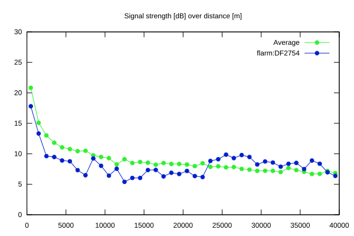
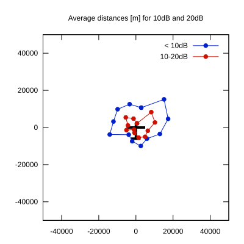

# Ktrax range report — device DF2754

- **Pilot:** Antolin Javier Valdes (club, CN 56)
- **Aircraft registration:** D-0003
- **live_track_id:** `OGNC307A4:FLRDF2754`
- **Ktrax callsign/ID:** D-0003
- **Last measurement:** 2026-07-18T15:45:19Z
- **Versions:** Hardware: 53/Software: 7.44 (received: 2026-07-18T15:29:28Z)
- **Source:** https://ktrax.kisstech.ch/plot?device=DF2754 (fetched 2026-07-19T09:38:11Z)

