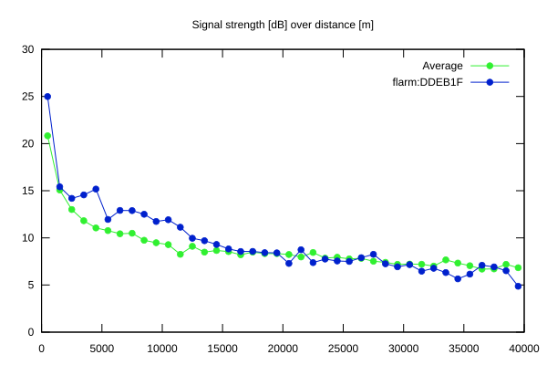
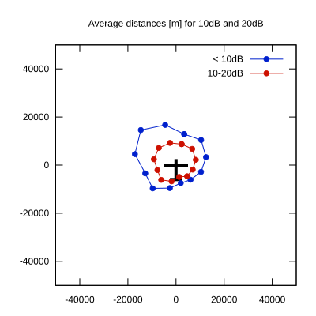

# Ktrax range report — device DDEB1F

- **Pilot:** Gvidas Sabeckis (club, CN 5)
- **Aircraft registration:** LY-GSY
- **live_track_id:** `OGNC309AC:FLRDDEB1F`
- **Ktrax callsign/ID:** LY-GSY
- **Last measurement:** 2026-07-18T15:11:46Z
- **Versions:** Hardware: 0F/Software: 7.40 (received: 2026-07-18T15:11:42Z)
- **Source:** https://ktrax.kisstech.ch/plot?device=DDEB1F (fetched 2026-07-19T09:38:11Z)

