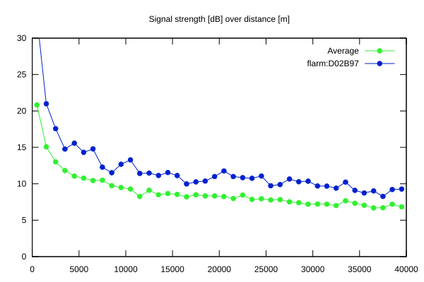
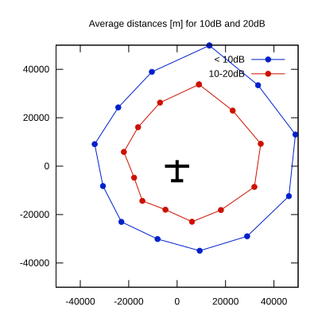

# Ktrax range report — device D02B97

- **Pilot:** Ivan Harašta (club, CN A3)
- **Aircraft registration:** OK-7787
- **live_track_id:** `OGNC30A50:FLRD02B97`
- **Ktrax callsign/ID:** OK-7787
- **Last measurement:** 2026-07-17T14:12:39Z
- **Versions:** Hardware: 41/Software: 7.43 (received: 2026-07-10T16:35:25Z)
- **Source:** https://ktrax.kisstech.ch/plot?device=D02B97 (fetched 2026-07-19T09:38:11Z)

