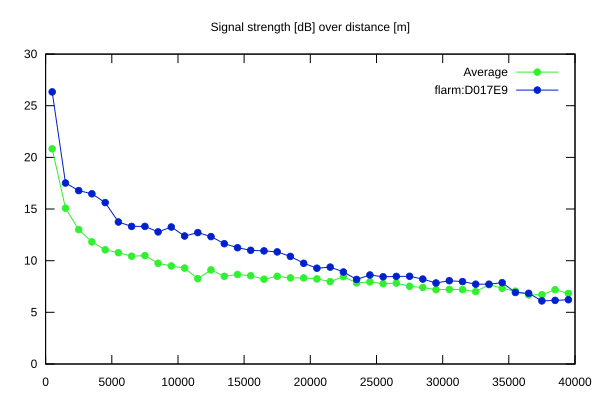
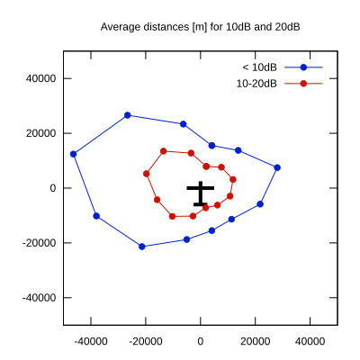

# Ktrax range report — device D017E9

- **Pilot:** György Gulyás (club, CN AD)
- **Aircraft registration:** D-2607
- **live_track_id:** `OGNC30774:FLRD017E9`
- **Ktrax callsign/ID:** D-2607
- **Last measurement:** 2026-07-18T15:41:17Z
- **Versions:** Hardware: 41/Software: 7.43 (received: 2026-07-18T15:16:09Z)
- **Source:** https://ktrax.kisstech.ch/plot?device=D017E9 (fetched 2026-07-19T09:38:11Z)

