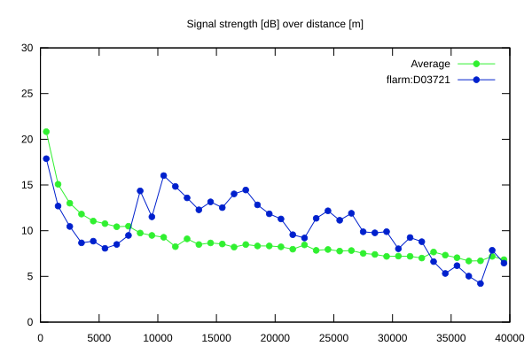
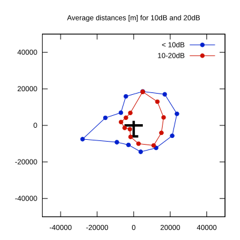

# Ktrax range report — device D03721

- **Pilot:** Jaume Prats (club, CN AL)
- **Aircraft registration:** D-7782
- **live_track_id:** `OGNC3080C:FLRD03721`
- **Ktrax callsign/ID:** D-7782
- **Last measurement:** 2026-07-19T06:02:56Z
- **Versions:** Hardware: 41/Software: 7.44 (received: 2026-07-19T06:00:17Z)
- **Source:** https://ktrax.kisstech.ch/plot?device=D03721 (fetched 2026-07-19T09:38:11Z)

