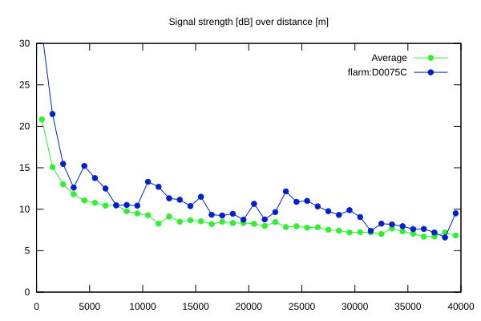
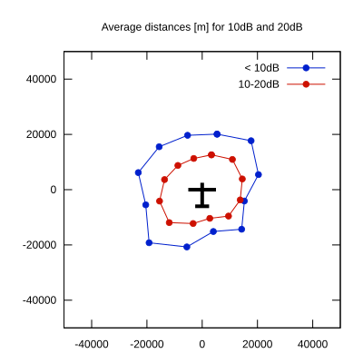

# Ktrax range report — device D0075C

- **Pilot:** Dylan Osolian (club, CN CP)
- **Aircraft registration:** D-2867
- **live_track_id:** `OGNC30A28:FLRD0075C`
- **Ktrax callsign/ID:** D-2867
- **Last measurement:** 2026-07-18T15:27:29Z
- **Versions:** Hardware: 41/Software: 7.40 (received: 2026-07-18T15:31:36Z)
- **Source:** https://ktrax.kisstech.ch/plot?device=D0075C (fetched 2026-07-19T09:38:11Z)

