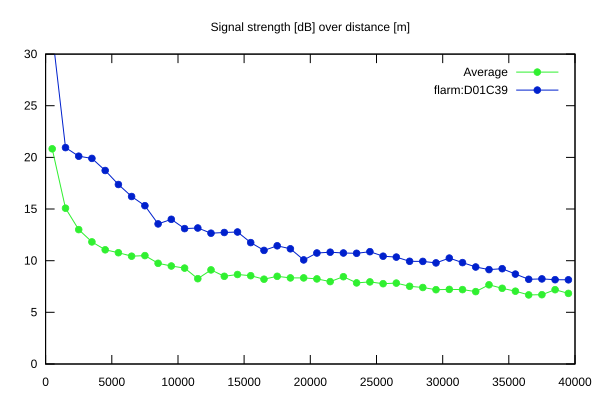
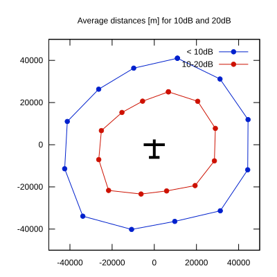

# Ktrax range report — device D01C39

- **Pilot:** Jaroslav Tomana (club, CN CX)
- **Aircraft registration:** OK-7779
- **live_track_id:** `OGNC30A30:FLRD01C39`
- **Ktrax callsign/ID:** OK-7779
- **Last measurement:** 2026-07-18T15:32:39Z
- **Versions:** Hardware: 41/Software: 7.43 (received: 2026-07-18T11:48:13Z)
- **Source:** https://ktrax.kisstech.ch/plot?device=D01C39 (fetched 2026-07-19T09:38:11Z)

