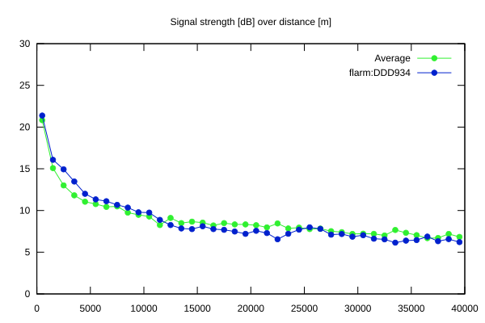
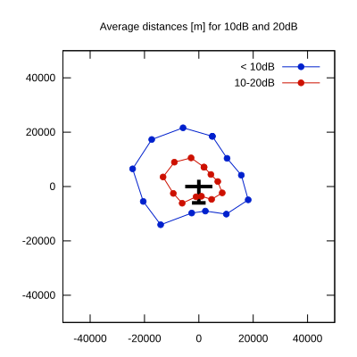

# Ktrax range report — device DDD934

- **Pilot:** Benjamin Payne (club, CN EEE)
- **Aircraft registration:** G-MEEE
- **live_track_id:** `OGNC30810:FLRDDD934`
- **Ktrax callsign/ID:** G-MEEE
- **Last measurement:** 2026-07-18T15:31:18Z
- **Versions:** Hardware: 0C/Software: 7.43 (received: 2026-07-18T15:32:11Z)
- **Source:** https://ktrax.kisstech.ch/plot?device=DDD934 (fetched 2026-07-19T09:38:11Z)

