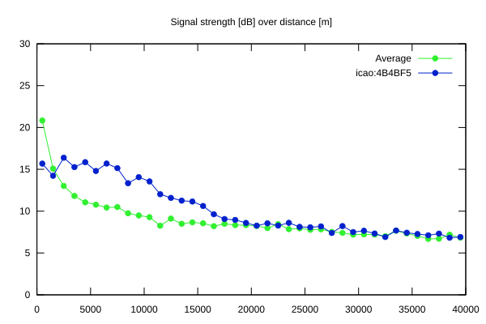
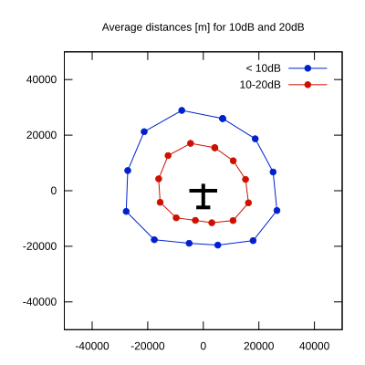

# Ktrax range report — device 4B4BF5

- **Pilot:** Pascal Zollikofer (club, CN FC)
- **Aircraft registration:** HB-1870
- **live_track_id:** `OGN6CAC84:ICA4B4BF5`
- **Ktrax callsign/ID:** HB-1870
- **Last measurement:** 2026-07-18T15:11:42Z
- **Versions:** Hardware: 0F/Software: 7.43 (received: 2026-07-18T15:19:03Z)
- **Source:** https://ktrax.kisstech.ch/plot?device=4B4BF5 (fetched 2026-07-19T09:38:11Z)

