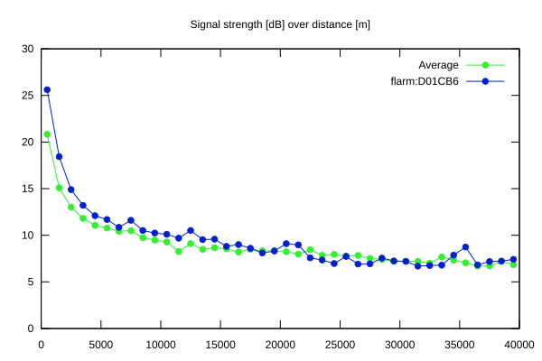
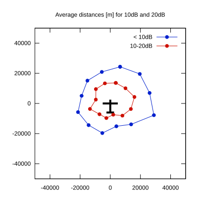

# Ktrax range report — device D01CB6

- **Pilot:** Tomasz Rubaj (club, CN FLS)
- **Aircraft registration:** SP-4148
- **live_track_id:** `OGNC309C0:FLRD01CB6`
- **Ktrax callsign/ID:** SP-4148
- **Last measurement:** 2026-07-18T15:33:10Z
- **Versions:** Hardware: 41/Software: 7.43 (received: 2026-07-18T15:19:01Z)
- **Source:** https://ktrax.kisstech.ch/plot?device=D01CB6 (fetched 2026-07-19T09:38:11Z)

