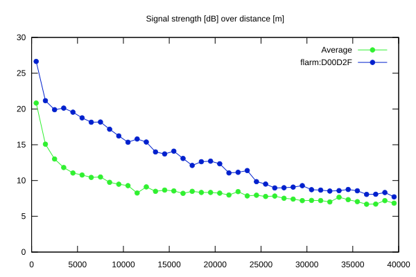
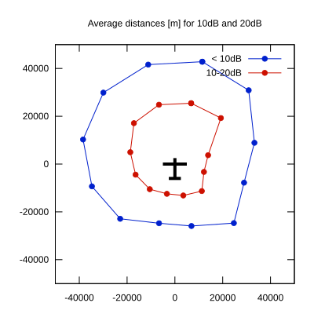

# Ktrax range report — device D00D2F

- **Pilot:** Kim Toppari (club, CN KT)
- **Aircraft registration:** OH-1043
- **live_track_id:** `OGNC308D4:FLRD00D2F`
- **Ktrax callsign/ID:** OH-1043
- **Last measurement:** 2026-07-18T15:11:42Z
- **Versions:** Hardware: 41/Software: 7.43 (received: 2026-07-18T15:15:40Z)
- **Source:** https://ktrax.kisstech.ch/plot?device=D00D2F (fetched 2026-07-19T09:38:11Z)

