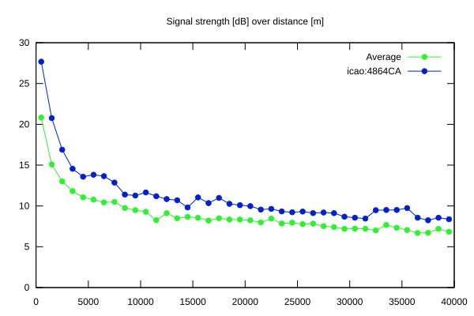
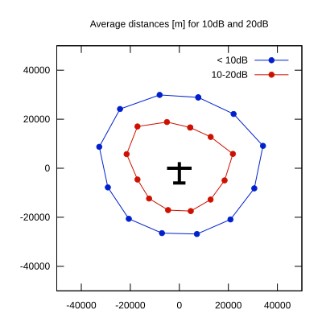

# Ktrax range report — device 4864CA

- **Pilot:** Roelof Corporaal (club, CN LK)
- **Aircraft registration:** PH-1668
- **live_track_id:** `OGNC30994:ICA4864CA`
- **Ktrax callsign/ID:** PH-1668
- **Last measurement:** 2026-07-18T15:30:01Z
- **Versions:** Hardware: 41/Software: 7.43 (received: 2026-07-18T15:31:58Z)
- **Source:** https://ktrax.kisstech.ch/plot?device=4864CA (fetched 2026-07-19T09:38:11Z)

