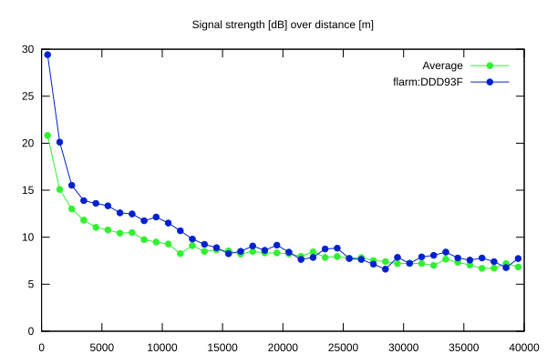

# Ktrax range report — device DDD93F

- **Pilot:** Vladas Motuza (15_meter, CN M7)
- **Aircraft registration:** D-8113
- **live_track_id:** `FLADDD93F`
- **Ktrax callsign/ID:** D-8113
- **Last measurement:** 2026-07-18T15:41:21Z
- **Versions:** Hardware: 0C/Software: 7.43 (received: 2026-07-18T14:31:17Z)
- **Source:** https://ktrax.kisstech.ch/plot?device=DDD93F (fetched 2026-07-19T09:38:11Z)

