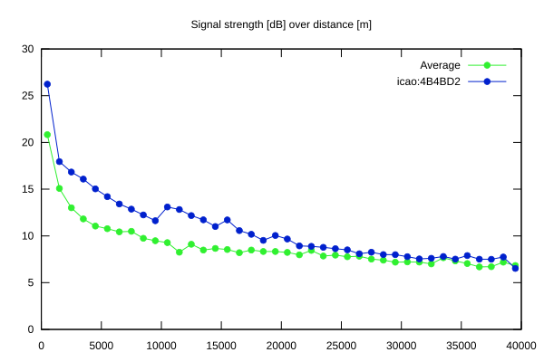
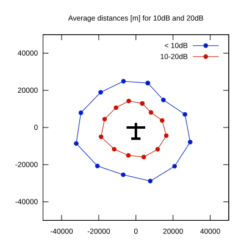

# Ktrax range report — device 4B4BD2

- **Pilot:** Simon Gantner (club, CN MN)
- **Aircraft registration:** HB-1835
- **live_track_id:** `OGNBF9098:ICA4B4BD2`
- **Ktrax callsign/ID:** HB-1835
- **Last measurement:** 2026-07-18T15:43:52Z
- **Versions:** Hardware: 43/Software: 7.43 (received: 2026-07-18T15:09:06Z)
- **Source:** https://ktrax.kisstech.ch/plot?device=4B4BD2 (fetched 2026-07-19T09:38:11Z)

