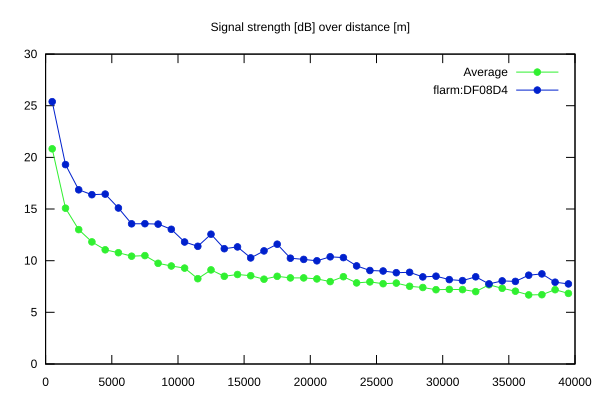
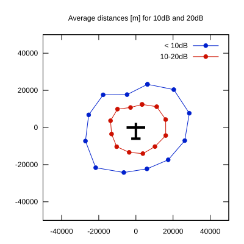

# Ktrax range report — device DF08D4

- **Pilot:** Alessandro Bassalti (club, CN MX)
- **Aircraft registration:** D-8309
- **live_track_id:** `OGNC30910:FLRDF08D4`
- **Ktrax callsign/ID:** D-8309
- **Last measurement:** 2026-07-18T15:11:45Z
- **Versions:** Hardware: 44/Software: 7.40 (received: 2026-07-18T15:16:12Z)
- **Source:** https://ktrax.kisstech.ch/plot?device=DF08D4 (fetched 2026-07-19T09:38:11Z)

