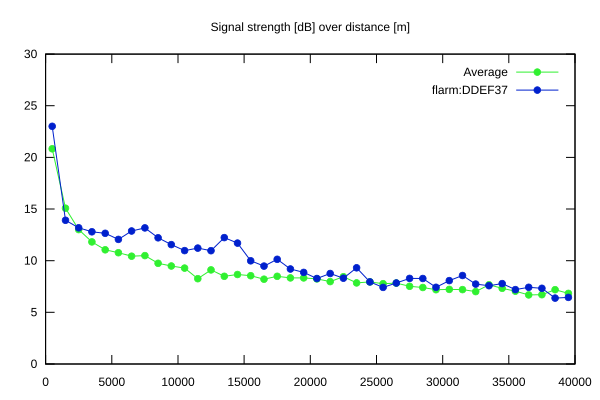
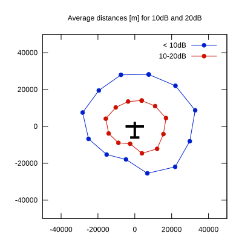

# Ktrax range report — device DDEF37

- **Pilot:** Toni Kittler (club, CN NZ)
- **Aircraft registration:** D-3897
- **live_track_id:** `OGNBF82F8:FLRDDEF37`
- **Ktrax callsign/ID:** D-3897
- **Last measurement:** 2026-07-18T15:11:45Z
- **Versions:** Hardware: 0F/Software: 7.43 (received: 2026-07-18T15:31:24Z)
- **Source:** https://ktrax.kisstech.ch/plot?device=DDEF37 (fetched 2026-07-19T09:38:11Z)

