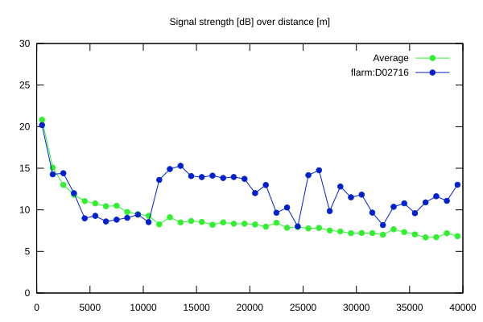
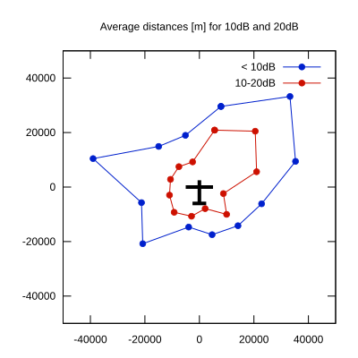

# Ktrax range report — device D02716

- **Pilot:** Tano Cavattoni (club, CN OO)
- **Aircraft registration:** D-0133
- **live_track_id:** `OGNC307F4:FLRD02716`
- **Ktrax callsign/ID:** D-0133
- **Last measurement:** 2026-07-18T15:11:43Z
- **Versions:** Hardware: 41/Software: 7.40 (received: 2026-07-18T15:12:06Z)
- **Source:** https://ktrax.kisstech.ch/plot?device=D02716 (fetched 2026-07-19T09:38:11Z)

