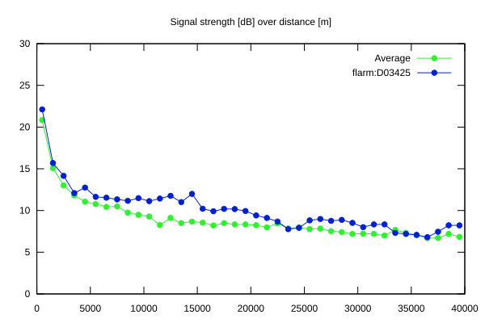
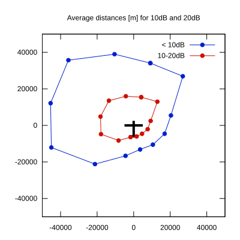

# Ktrax range report — device D03425

- **Pilot:** Mikołaj Zdun (club, CN PP)
- **Aircraft registration:** SP-3978
- **live_track_id:** `OGNC30A84:FLRD03425`
- **Ktrax callsign/ID:** SP-3978
- **Last measurement:** 2026-07-18T15:48:48Z
- **Versions:** Hardware: 41/Software: 7.43 (received: 2026-07-18T15:31:59Z)
- **Source:** https://ktrax.kisstech.ch/plot?device=D03425 (fetched 2026-07-19T09:38:11Z)

