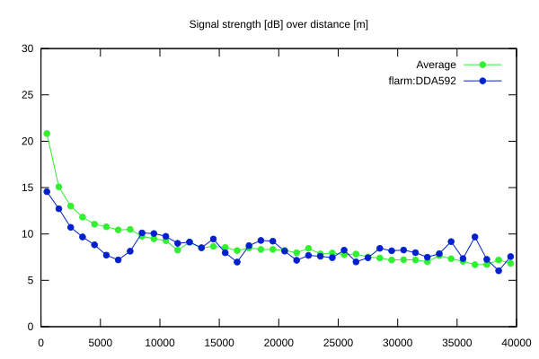
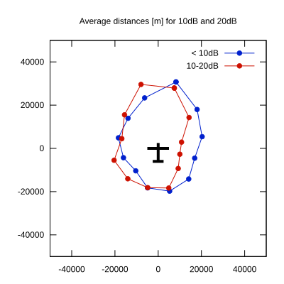

# Ktrax range report — device DDA592

- **Pilot:** Michiel Van den Borne (club, CN PX)
- **Aircraft registration:** D-6612
- **live_track_id:** `OGNBF82E0:FLRDDA592`
- **Ktrax callsign/ID:** D-6612
- **Last measurement:** 2026-07-18T15:25:02Z
- **Versions:** Hardware: 03/Software: 7.43 (received: 2026-07-18T15:31:11Z)
- **Source:** https://ktrax.kisstech.ch/plot?device=DDA592 (fetched 2026-07-19T09:38:11Z)

