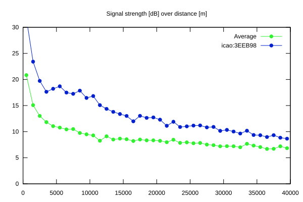
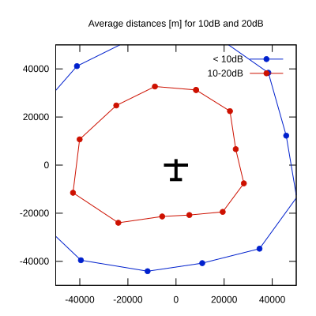

# Ktrax range report — device 3EEB98

- **Pilot:** Alexandre Fierain (club, CN SN)
- **Aircraft registration:** D-2817
- **live_track_id:** `OGNC307D0:ICA3EEB98`
- **Ktrax callsign/ID:** D-2817
- **Last measurement:** 2026-07-18T15:11:44Z
- **Versions:** Hardware: 53/Software: 7.40 (received: 2026-07-18T15:13:17Z)
- **Source:** https://ktrax.kisstech.ch/plot?device=3EEB98 (fetched 2026-07-19T09:38:11Z)

