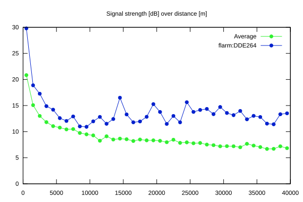
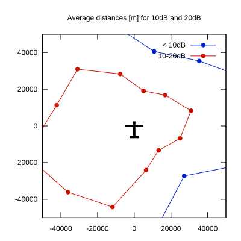

# Ktrax range report — device DDE264

- **Pilot:** Francis Svobodny (club, CN WE)
- **Aircraft registration:** F-CGKS
- **live_track_id:** `OGNC3074C:FLRDDE264`
- **Ktrax callsign/ID:** F-CGKS
- **Last measurement:** 2026-07-18T15:25:28Z
- **Versions:** Hardware: 0C/Software: 7.43 (received: 2026-07-18T15:16:16Z)
- **Source:** https://ktrax.kisstech.ch/plot?device=DDE264 (fetched 2026-07-19T09:38:11Z)

