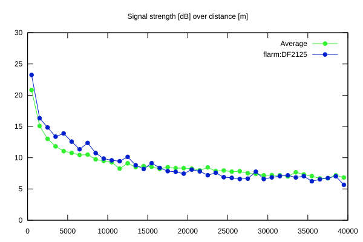
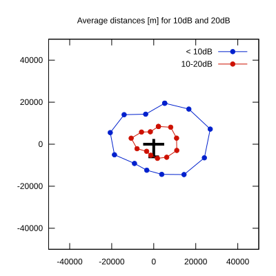

# Ktrax range report — device DF2125

- **Pilot:** Ferenc Tamás (club, CN XW)
- **Aircraft registration:** D-7734
- **live_track_id:** `OGNC30A10:FLRDF2125`
- **Ktrax callsign/ID:** D-7734
- **Last measurement:** 2026-07-18T15:36:44Z
- **Versions:** Hardware: 53/Software: 7.43 (received: 2026-07-18T15:19:29Z)
- **Source:** https://ktrax.kisstech.ch/plot?device=DF2125 (fetched 2026-07-19T09:38:11Z)

