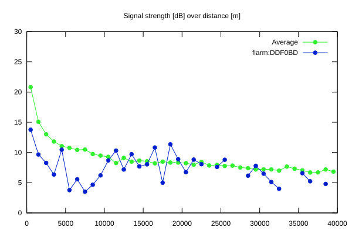
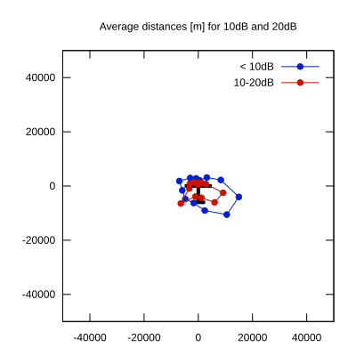

# Ktrax range report — device DDF0BD

- **Pilot:** Tudor Bajenaru (club, CN Y3)
- **Aircraft registration:** YR-1021
- **live_track_id:** `OGNC30AD0:FLRDDF0BD`
- **Ktrax callsign/ID:** YR-1021
- **Last measurement:** 2026-07-18T15:46:08Z
- **Versions:** Hardware: 0F/Software: 7.43 (received: 2026-07-18T14:54:23Z)
- **Source:** https://ktrax.kisstech.ch/plot?device=DDF0BD (fetched 2026-07-19T09:38:11Z)

