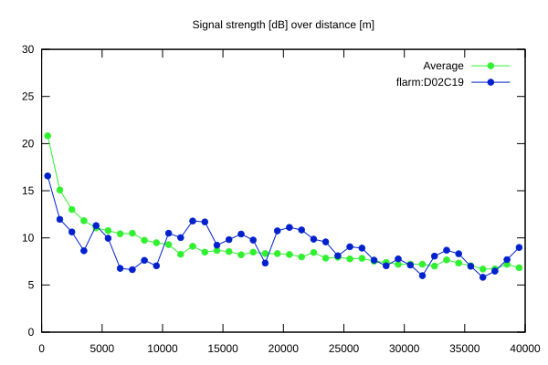
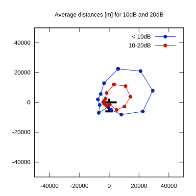

# Ktrax range report — device D02C19

- **Pilot:** Filip Bojanowski (club, CN YC)
- **Aircraft registration:** D-8181
- **live_track_id:** `OGNC30830:FLRD02C19`
- **Ktrax callsign/ID:** D-8181
- **Last measurement:** 2026-07-18T15:45:14Z
- **Versions:** Hardware: 41/Software: 7.43 (received: 2026-07-18T15:17:20Z)
- **Source:** https://ktrax.kisstech.ch/plot?device=D02C19 (fetched 2026-07-19T09:38:11Z)

