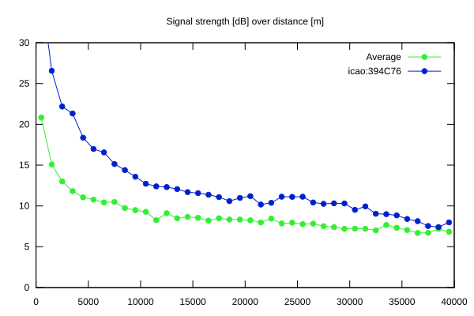
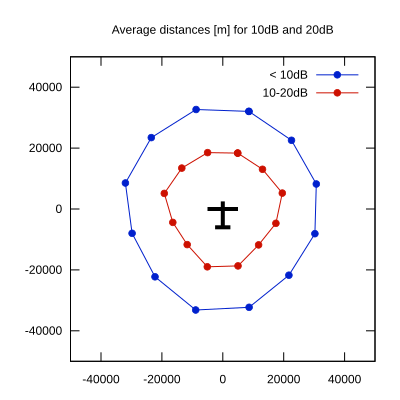

# Ktrax range report — device 394C76

- **Pilot:** de Péchy & Duboc (double_seater, CN MG)
- **Aircraft registration:** F-COMG
- **live_track_id:** `OGN6CAC30:ICA394C76`
- **Ktrax callsign/ID:** F-COMG
- **Last measurement:** 2026-07-18T17:03:03Z
- **Versions:** Hardware: 53/Software: 7.40 (received: 2026-07-18T16:59:28Z)
- **Source:** https://ktrax.kisstech.ch/plot?device=394C76 (fetched 2026-07-19T09:14:46Z)

