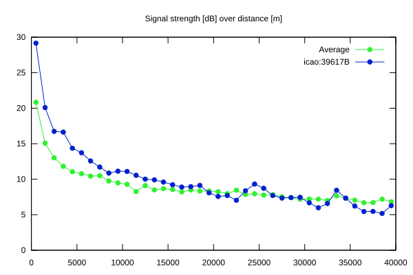
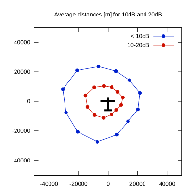

# Ktrax range report — device 39617B

- **Pilot:** Christophe Abadie (18_meter, CN 2L)
- **Aircraft registration:** F-CYLU
- **live_track_id:** `OGNC308E8:ICA39617B`
- **Ktrax callsign/ID:** -
- **Last measurement:** 2026-07-18T15:59:25Z
- **Versions:** Hardware: 41/Software: 7.43 (received: 2026-07-18T14:45:32Z)
- **Source:** https://ktrax.kisstech.ch/plot?device=39617B (fetched 2026-07-19T09:14:46Z)

