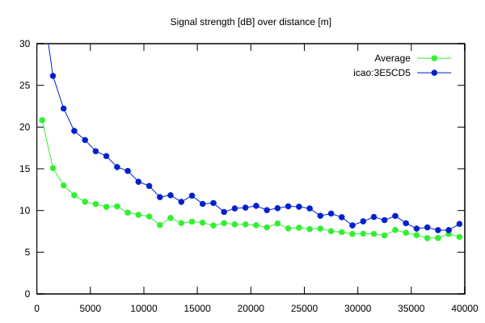
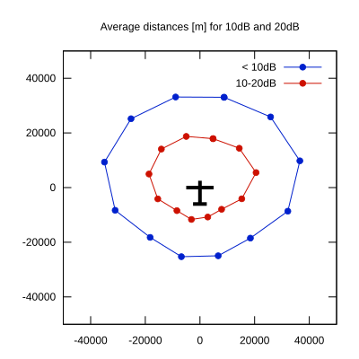

# Ktrax range report — device 3E5CD5

- **Pilot:** Motuza & Volkov (double_seater, CN AV)
- **Aircraft registration:** D-KAIV
- **live_track_id:** `OGN6CAC40:ICA3E5CD5`
- **Ktrax callsign/ID:** D-KAIV
- **Last measurement:** 2026-07-17T15:39:09Z
- **Versions:** Hardware: 41/Software: 7.43 (received: 2026-07-17T15:19:37Z)
- **Source:** https://ktrax.kisstech.ch/plot?device=3E5CD5 (fetched 2026-07-19T09:14:46Z)

