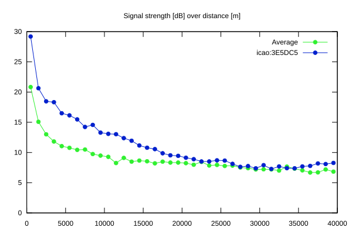
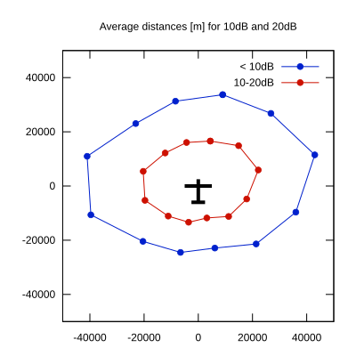

# Ktrax range report — device 3E5DC5

- **Pilot:** Kornel Negro (18_meter, CN GPS)
- **Aircraft registration:** D-KASB
- **live_track_id:** `OGNC307D8:ICA3E5DC5`
- **Ktrax callsign/ID:** D-KASB
- **Last measurement:** 2026-07-18T16:11:09Z
- **Versions:** Hardware: 41/Software: 7.43 (received: 2026-07-18T16:07:04Z)
- **Source:** https://ktrax.kisstech.ch/plot?device=3E5DC5 (fetched 2026-07-19T09:14:46Z)

