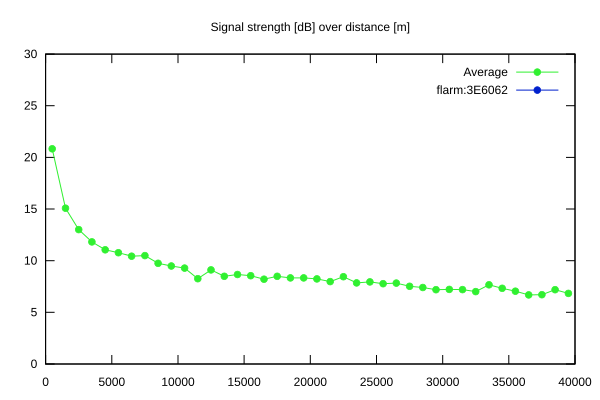

# Ktrax range report — device 3E6062

- **Pilot:** Mauro Brunazzo (18_meter, CN MA)
- **Aircraft registration:** D-KBRU
- **live_track_id:** `OGNC30A24:ICA3E6062`
- **Ktrax callsign/ID:** D-KBRU
- **Last measurement:** 2026-07-09T16:12:13Z
- **Versions:** Hardware: -/Software: - (received: -)
- **Source:** https://ktrax.kisstech.ch/plot?device=3E6062 (fetched 2026-07-19T09:14:46Z)

