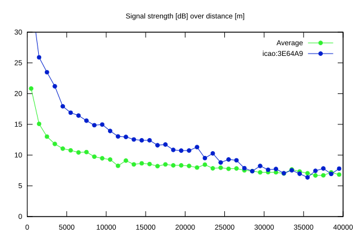
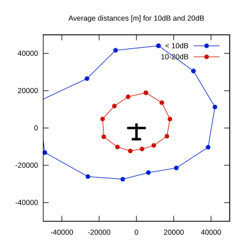

# Ktrax range report — device 3E64A9

- **Pilot:** Dennis Huybreckx (18_meter, CN HX)
- **Aircraft registration:** D-KDHX
- **live_track_id:** `OGNC308D4:ICA3E64A9`
- **Ktrax callsign/ID:** D-KDHX
- **Last measurement:** 2026-07-18T15:44:43Z
- **Versions:** Hardware: 41/Software: 7.43 (received: 2026-07-18T15:43:45Z)
- **Source:** https://ktrax.kisstech.ch/plot?device=3E64A9 (fetched 2026-07-19T09:14:46Z)

