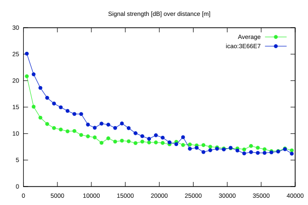
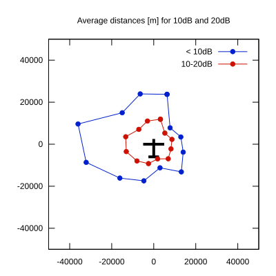

# Ktrax range report — device 3E66E7

- **Pilot:** Joze Verdev (18_meter, CN DZ)
- **Aircraft registration:** D-KEDZ
- **live_track_id:** `OGNE33EAD:ICA3E66E7`
- **Ktrax callsign/ID:** D-KEDZ
- **Last measurement:** 2026-07-07T15:40:51Z
- **Versions:** Hardware: 41/Software: 7.43 (received: 2026-07-07T16:52:03Z)
- **Source:** https://ktrax.kisstech.ch/plot?device=3E66E7 (fetched 2026-07-19T09:14:46Z)

