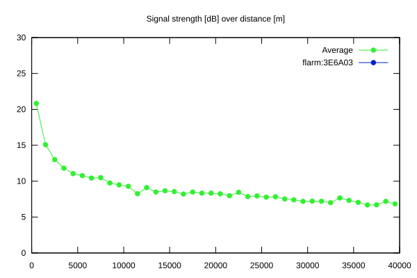

# Ktrax range report — device 3E6A03

- **Pilot:** Pierre de Broqueville (open, CN IP3)
- **Aircraft registration:** D-KFIP
- **live_track_id:** `OGNC307D0:ICA3E6A03`
- **Ktrax callsign/ID:** D-KFIP
- **Last measurement:** 2026-07-09T16:20:25Z
- **Versions:** Hardware: -/Software: - (received: -)
- **Source:** https://ktrax.kisstech.ch/plot?device=3E6A03 (fetched 2026-07-19T09:14:46Z)

