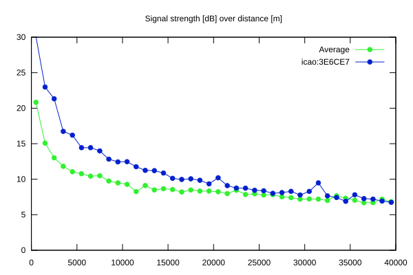
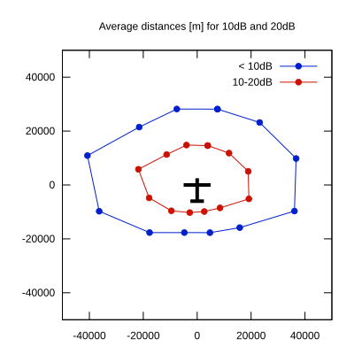

# Ktrax range report — device 3E6CE7

- **Pilot:** Bernhard Leitner (18_meter, CN BL)
- **Aircraft registration:** D-KGLB
- **live_track_id:** `OGNC309AC:ICA3E6CE7`
- **Ktrax callsign/ID:** D-KGLB
- **Last measurement:** 2026-07-11T19:00:22Z
- **Versions:** Hardware: 41/Software: 7.43 (received: 2026-07-11T18:58:46Z)
- **Source:** https://ktrax.kisstech.ch/plot?device=3E6CE7 (fetched 2026-07-19T09:14:46Z)

