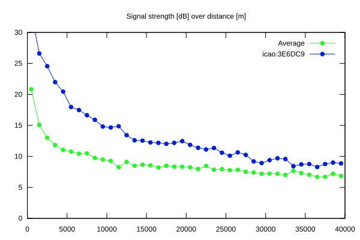
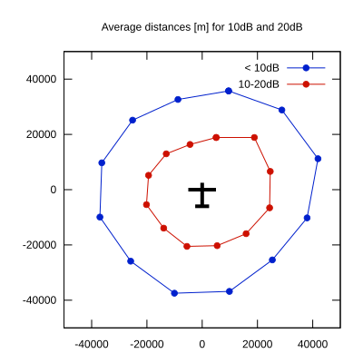

# Ktrax range report — device 3E6DC9

- **Pilot:** Peter Johansson (18_meter, CN 2T)
- **Aircraft registration:** D-KGTT
- **live_track_id:** `OGNBF8334:ICA3E6DC9`
- **Ktrax callsign/ID:** D-KGTT
- **Last measurement:** 2026-07-04T15:45:21Z
- **Versions:** Hardware: 41/Software: 7.43 (received: 2026-07-04T15:42:46Z)
- **Source:** https://ktrax.kisstech.ch/plot?device=3E6DC9 (fetched 2026-07-19T09:14:46Z)

