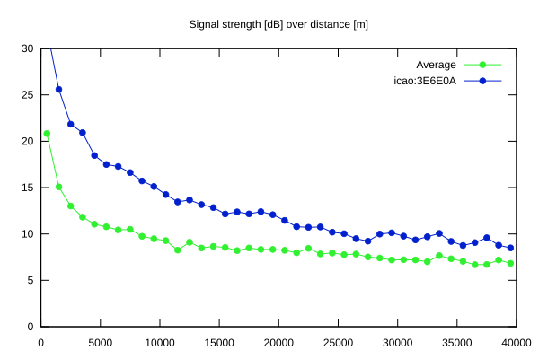
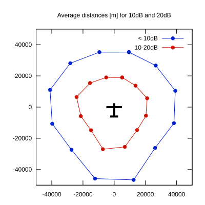

# Ktrax range report — device 3E6E0A

- **Pilot:** Werner Amann (18_meter, CN WG)
- **Aircraft registration:** D-KGWG
- **live_track_id:** `OGNBF9084:ICA3E6E0A`
- **Ktrax callsign/ID:** D-KGWG
- **Last measurement:** 2026-07-18T13:26:24Z
- **Versions:** Hardware: 41/Software: 7.43 (received: 2026-07-18T13:23:33Z)
- **Source:** https://ktrax.kisstech.ch/plot?device=3E6E0A (fetched 2026-07-19T09:14:46Z)

