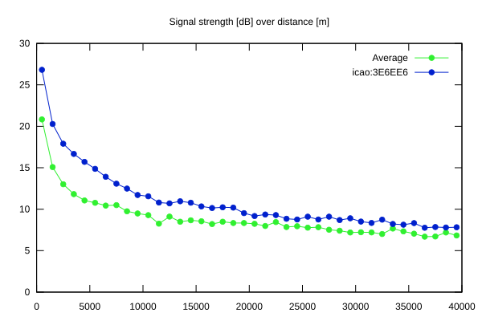
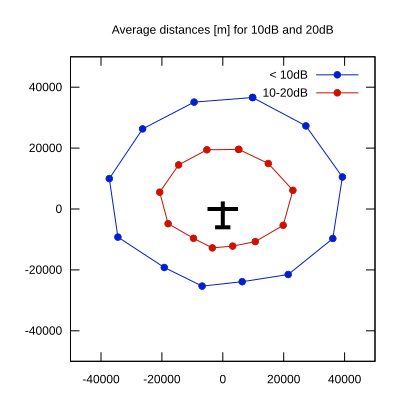

# Ktrax range report — device 3E6EE6

- **Pilot:** Leucker & Omsels (double_seater, CN HLB)
- **Aircraft registration:** D-KHLB
- **live_track_id:** `OGN6C7B4C:ICA3E6EE6`
- **Ktrax callsign/ID:** D-KHES
- **Last measurement:** 2026-07-18T16:42:12Z
- **Versions:** Hardware: 53/Software: 7.43 (received: 2026-07-17T09:22:16Z)
- **Source:** https://ktrax.kisstech.ch/plot?device=3E6EE6 (fetched 2026-07-19T09:14:46Z)

