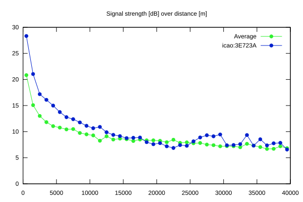
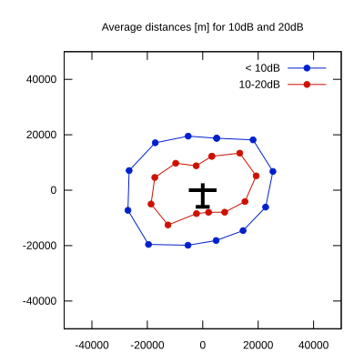

# Ktrax range report — device 3E723A

- **Pilot:** Antolín Javier Valdés Galera (18_meter, CN JP)
- **Aircraft registration:** D-KILM
- **live_track_id:** `OGN6CAC84:ICA3E723A`
- **Ktrax callsign/ID:** D-KILM
- **Last measurement:** 2026-06-21T17:17:20Z
- **Versions:** Hardware: 41/Software: 7.43 (received: 2026-06-21T16:00:52Z)
- **Source:** https://ktrax.kisstech.ch/plot?device=3E723A (fetched 2026-07-19T09:14:46Z)

