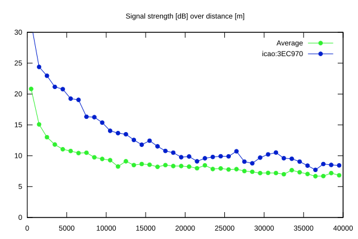
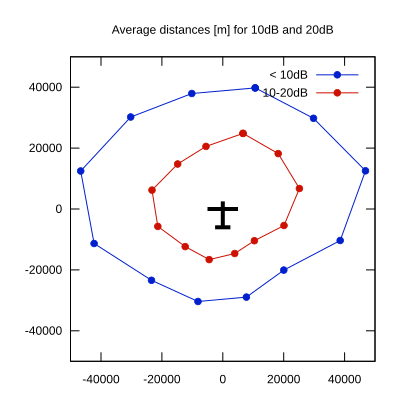

# Ktrax range report — device 3EC970

- **Pilot:** Janowitsch & Lutz (double_seater, CN 13)
- **Aircraft registration:** D-KRGA
- **live_track_id:** `OGNC309EC:ICA3EC970`
- **Ktrax callsign/ID:** D-KRGA
- **Last measurement:** 2026-07-11T10:38:49Z
- **Versions:** Hardware: 41/Software: 7.43 (received: 2026-07-11T10:37:53Z)
- **Source:** https://ktrax.kisstech.ch/plot?device=3EC970 (fetched 2026-07-19T09:14:46Z)

