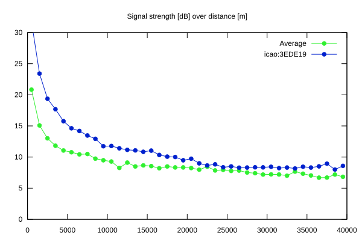
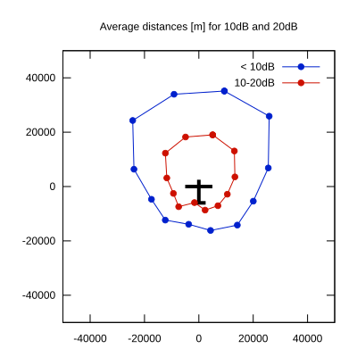

# Ktrax range report — device 3EDE19

- **Pilot:** Boris Žorž (18_meter, CN BI)
- **Aircraft registration:** D-KZBL
- **live_track_id:** `OGNC30870:ICA3EDE19`
- **Ktrax callsign/ID:** D-KZBL
- **Last measurement:** 2026-07-12T16:46:15Z
- **Versions:** Hardware: 41/Software: 7.43 (received: 2026-07-12T16:41:01Z)
- **Source:** https://ktrax.kisstech.ch/plot?device=3EDE19 (fetched 2026-07-19T09:14:46Z)

