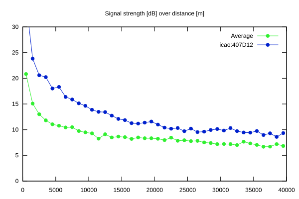
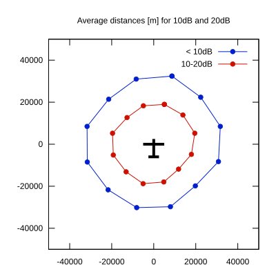

# Ktrax range report — device 407D12

- **Pilot:** Derren P. Francis (18_meter, CN F2)
- **Aircraft registration:** G-GFEF
- **live_track_id:** `OGNC30A7C:ICA407D12`
- **Ktrax callsign/ID:** G-GFEF
- **Last measurement:** 2026-07-09T15:47:29Z
- **Versions:** Hardware: 41/Software: 7.43 (received: 2026-07-09T15:28:24Z)
- **Source:** https://ktrax.kisstech.ch/plot?device=407D12 (fetched 2026-07-19T09:14:46Z)

