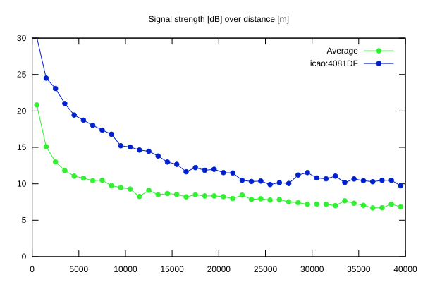
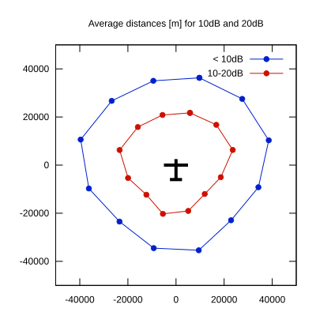

# Ktrax range report — device 4081DF

- **Pilot:** Jones & Coppin (double_seater, CN i10)
- **Aircraft registration:** G-JIIO
- **live_track_id:** `OGN6C7B48:ICA4081DF`
- **Ktrax callsign/ID:** G-JIIO
- **Last measurement:** 2026-07-19T09:14:29Z
- **Versions:** Hardware: 53/Software: 7.43 (received: 2026-07-19T09:10:02Z)
- **Source:** https://ktrax.kisstech.ch/plot?device=4081DF (fetched 2026-07-19T09:14:46Z)

