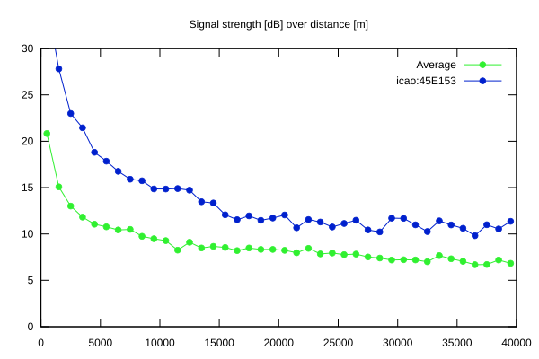
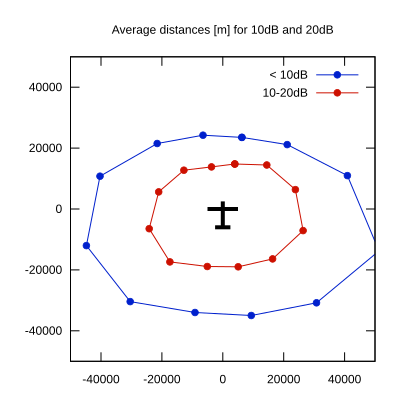

# Ktrax range report — device 45E153

- **Pilot:** Tom Jørgensen (18_meter, CN 3)
- **Aircraft registration:** OY-XJS
- **live_track_id:** `OGNBF920C:ICA45E153`
- **Ktrax callsign/ID:** OY-XJS
- **Last measurement:** 2026-07-11T15:16:35Z
- **Versions:** Hardware: 53/Software: 7.43 (received: 2026-07-11T15:12:21Z)
- **Source:** https://ktrax.kisstech.ch/plot?device=45E153 (fetched 2026-07-19T09:14:46Z)

