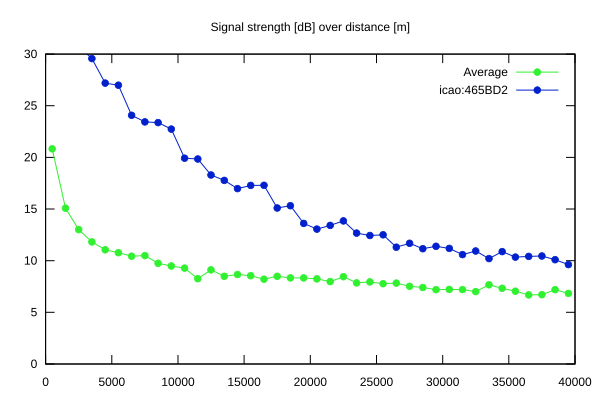
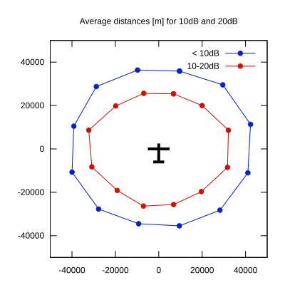

# Ktrax range report — device 465BD2

- **Pilot:** Aku Jaakkola (18_meter, CN W)
- **Aircraft registration:** OH-1026
- **live_track_id:** `OGNC309E8:ICA465BD2`
- **Ktrax callsign/ID:** OH-1026
- **Last measurement:** 2026-07-17T13:02:16Z
- **Versions:** Hardware: 41/Software: 7.43 (received: 2026-07-17T12:53:10Z)
- **Source:** https://ktrax.kisstech.ch/plot?device=465BD2 (fetched 2026-07-19T09:14:46Z)

