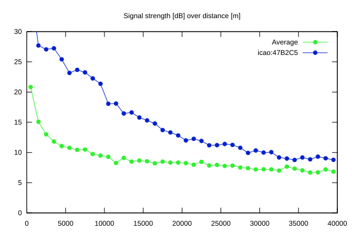
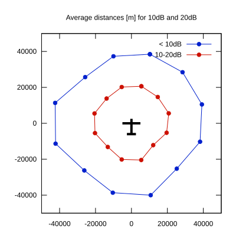

# Ktrax range report — device 47B2C5

- **Pilot:** Rune Hovda (18_meter, CN RH)
- **Aircraft registration:** LN-GRH
- **live_track_id:** `OGNBF82E0:ICA47B2C5`
- **Ktrax callsign/ID:** LN-GRH
- **Last measurement:** 2026-07-18T12:46:22Z
- **Versions:** Hardware: 53/Software: 7.40 (received: 2026-07-18T12:45:44Z)
- **Source:** https://ktrax.kisstech.ch/plot?device=47B2C5 (fetched 2026-07-19T09:14:46Z)

