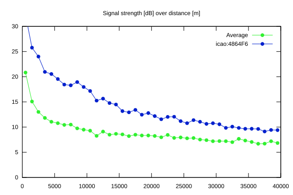
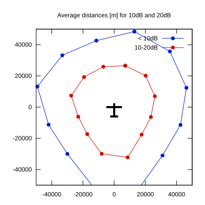

# Ktrax range report — device 4864F6

- **Pilot:** Max Leenders (open, CN UFO)
- **Aircraft registration:** PH-1680
- **live_track_id:** `OGNC30910:ICA4864F6`
- **Ktrax callsign/ID:** PH-1680
- **Last measurement:** 2026-07-18T11:01:11Z
- **Versions:** Hardware: 41/Software: 7.43 (received: 2026-07-14T14:30:49Z)
- **Source:** https://ktrax.kisstech.ch/plot?device=4864F6 (fetched 2026-07-19T09:14:46Z)

