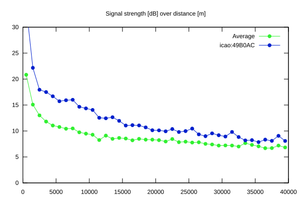
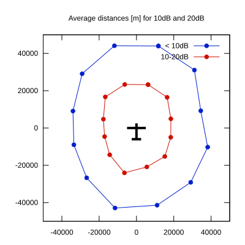

# Ktrax range report — device 49B0AC

- **Pilot:** Radek Krejcirik (18_meter, CN Q1)
- **Aircraft registration:** OK-2025
- **live_track_id:** `OGNC30914:ICA49B0AC`
- **Ktrax callsign/ID:** OK-2025
- **Last measurement:** 2026-07-11T17:14:52Z
- **Versions:** Hardware: 41/Software: 7.43 (received: 2026-07-11T17:13:54Z)
- **Source:** https://ktrax.kisstech.ch/plot?device=49B0AC (fetched 2026-07-19T09:14:46Z)

