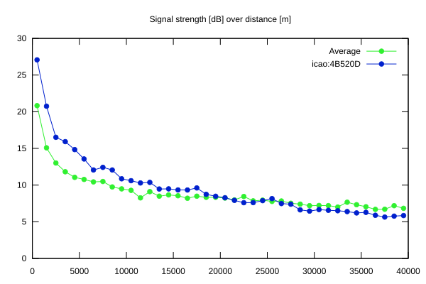
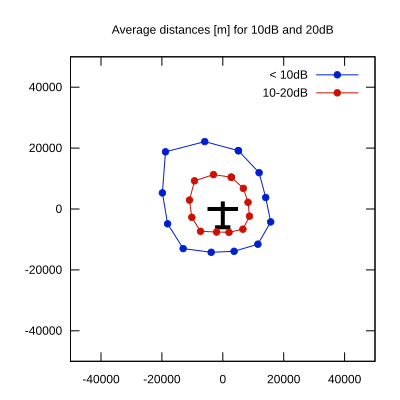

# Ktrax range report — device 4B520D

- **Pilot:** Yves Müller (18_meter, CN YS)
- **Aircraft registration:** HB-3430
- **live_track_id:** `OGN6CAC70:ICA4B520D`
- **Ktrax callsign/ID:** HB-3430
- **Last measurement:** 2026-07-18T16:08:16Z
- **Versions:** Hardware: 41/Software: 7.43 (received: 2026-07-18T16:04:38Z)
- **Source:** https://ktrax.kisstech.ch/plot?device=4B520D (fetched 2026-07-19T09:14:46Z)

